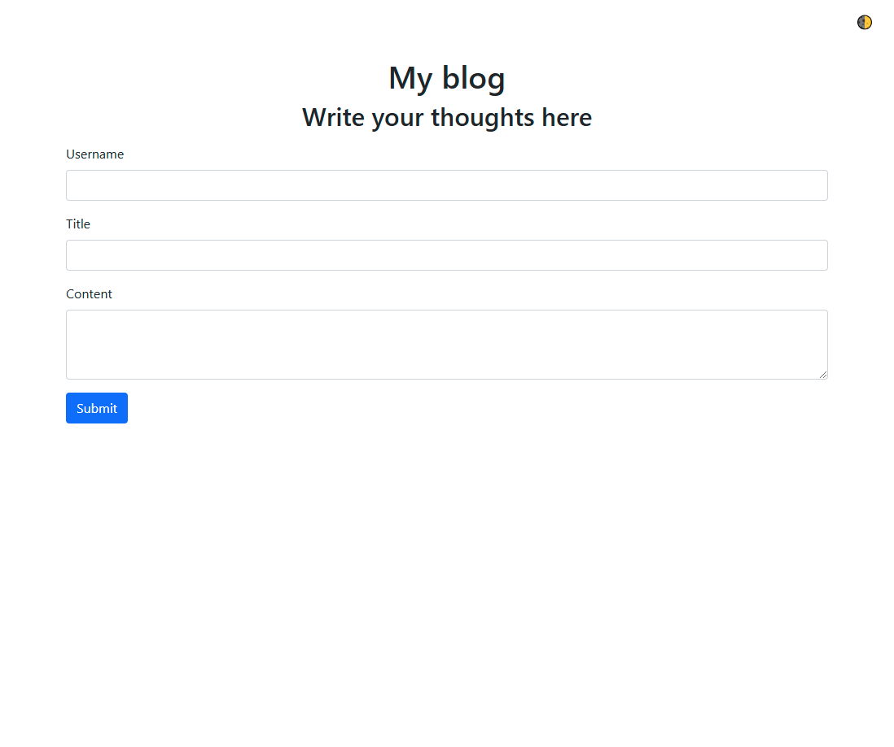
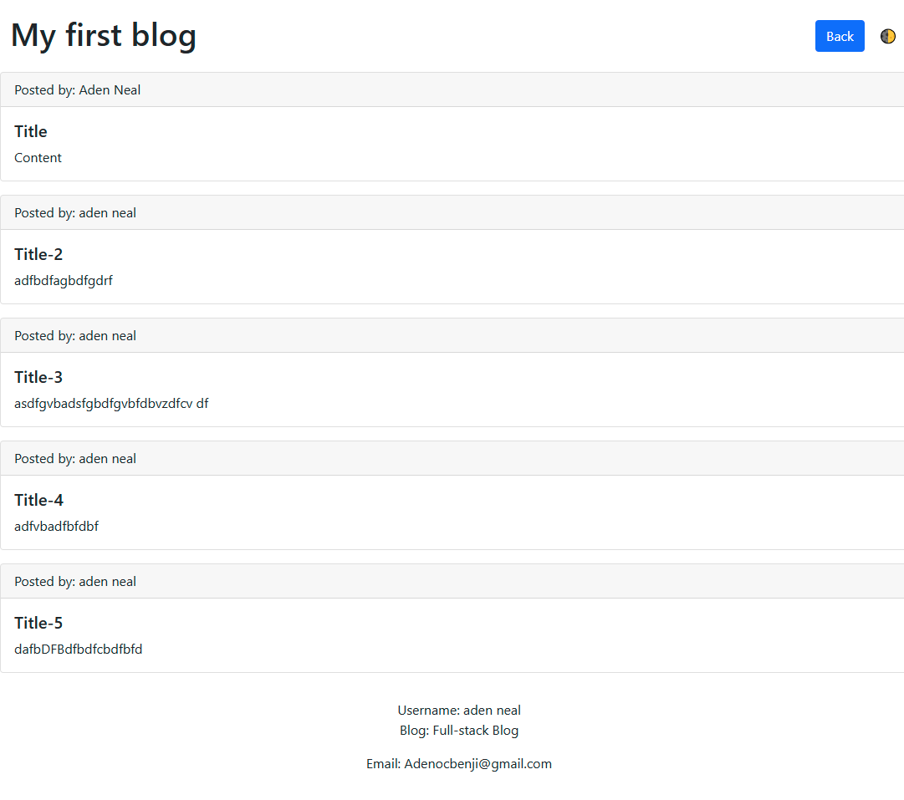

# Challenge-4

## Purpose and Description

The purpose of this website is to store and display a bloger's information

The user inputs Username, Title, and Content. Then the website takes the user input from a form and stores it in local storage. The user is the directed to a blog page where all of the blog posts are displayed in card form with a footer that contains the users username, blog type, and email. The user also has the option to change the theme of the site with a dark mode selector in the top right.

## Tech stack

* JavaScript was used to add functionality and lagic to the website
* HTML was used to structure the website 
* CSS was used to style the website

## Design

## Link to finished website
https://adenman.github.io/Challenge-4/
